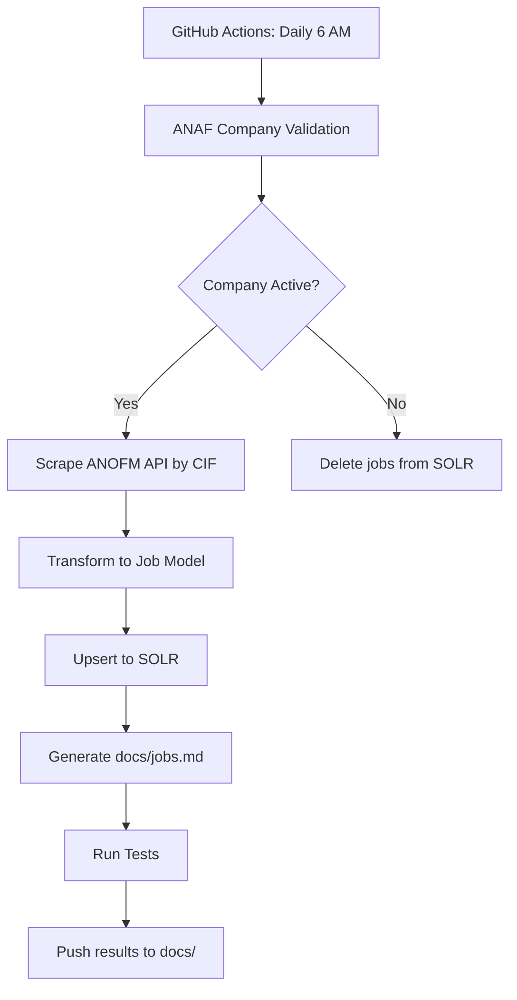

# job_seeker_ro_spider — GUSTURI DIVINE S.R.L. Scraper

[](https://github.com/sebiboga/gusturi-divine-srl-nodejs-scraper/actions/workflows/job-seeker-ro-spider.yml)
[](https://github.com/sebiboga/gusturi-divine-srl-nodejs-scraper/actions/workflows/automation-testing.yml)

[](CHANGELOG.md)
[](https://sebiboga.github.io/gusturi-divine-srl-nodejs-scraper/test-results/)
[](LICENSE)
[](https://ecma-international.org/)
[](https://nodejs.org/)
[](https://peviitor.ro)
[](https://api.peviitor.ro/)
[](https://solr.peviitor.ro/solr/)
[](https://sebiboga.github.io/gusturi-divine-srl-nodejs-scraper/)

**job_seeker_ro_spider** — un scraper pentru job-urile GUSTURI DIVINE S.R.L. din România. Extrage anunțurile de pe [ANOFM](https://www.anofm.ro) și le publică în [peviitor.ro](https://peviitor.ro) prin API-ul SOLR.

> **Derivat din:** [EPAM Systems International SRL Node.js Scraper](https://github.com/sebiboga/epam-systems-international-srl-nodejs-scraper) — șablonul de referință pentru scraper-ele Node.js din ecosistemul peviitor.ro.

## Overview

Proiectul automatizează colectarea zilnică a job-urilor GUSTURI DIVINE S.R.L. din România, menținând board-ul peviitor.ro la zi cu cele mai recente oportunități de carieră.

## Features

- **ANOFM API**: Queries job listings by company CIF
- **ANAF Validation**: Validates company existence and status before scraping
- **SOLR Storage**: Stores job data for peviitor.ro
- **Automated CI**: Daily scheduled scraping via GitHub Actions
- **Multi-layer tests**: Unit, integration, E2E, consistency

## Quick Start

```bash
# Install dependencies
npm install

# Run the scraper (test mode — single page)
npm run scrape -- --test

# Run all tests
npm test
```

## How It Works



## ANOFM API

The scraper uses the public ANOFM API:

```
POST https://mediere.anofm.ro/api/entity/vw_public_job_posting
```

With payload:
```json
{
  "current": 1,
  "rowCount": 250,
  "sort": { "created_at": "desc" },
  "employer_tax_code": "<CIF>"
}
```

## Project Structure

```
├── index.js                 # Main scraper entry point
├── company.js               # Company validation (ANAF)
├── solr.js                  # SOLR database operations
├── config/
│   └── company.json         # Single source of truth for company identity
├── src/
│   ├── anaf.js              # ANAF API client
│   ├── markdown-generator.js # Job markdown generator
│   └── job-validator.js     # URL validation
├── tests/
│   ├── unit/                # Unit tests
│   ├── integration/         # Integration tests
│   ├── e2e/                 # End-to-end tests
│   └── consistency/         # Repository consistency tests
├── docs/
│   ├── index.html           # GitHub Pages job board
│   ├── company.json         # Company config for HTML page
│   └── jobs.md              # Generated job listings
└── .github/workflows/
    ├── job-seeker-ro-spider.yml     # Main scraping workflow
    └── automation-testing.yml       # Test automation workflow
```

## Testing

```bash
# Run all tests
npm test

# Test categories:
npm run test:unit          # Unit tests (fast, no external deps)
npm run test:integration   # Integration tests (ANAF/SOLR)
npm run test:e2e           # E2E tests (full pipeline)
npm run test:consistency   # Repository consistency checks
```

## License

MIT — see [LICENSE](LICENSE).
